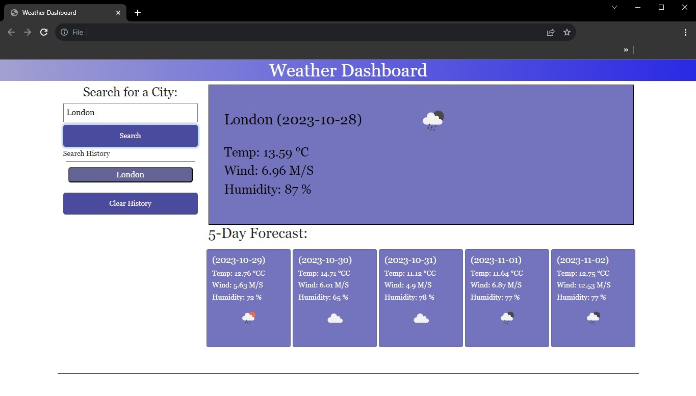

# Weather Dashboard

## Description

https://ant-m84.github.io/Weather-Forecast/

This application utilizes the OpenWeatherMap API to generate a weather forecast based upon the users choice.

## Usage

To use the Weather Dashboard, enter the name of the city whose weather forecast you wish to view and click 'Search'. The current weather for the day will be displayed, followed by the forecast for the following 5 days.

You can repeat the above process to search different cities.

The search history will appear below and you may click on past searches to regenerate the data for that city.

Clicking the 'Clear History' button will clear the data and reload the page.

## Credits

This application was quite a challenege for me and help with developing and debugging the code was obtained from the following source:

CodingNepal. (2023, June 28). How to Build A Weather App in HTML CSS and JavaScript. https://www.codingnepalweb.com/weather-app-project-html-javascript/

Mozilla Developer. (2023). Element: insertAdjacentHTML() method. https://developer.mozilla.org/en-US/docs/Web/API/Element/insertAdjacentHTML
